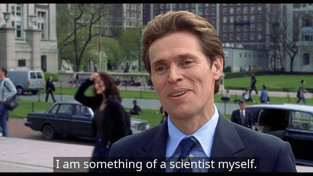

Hi there 👋
--------

I'm Eze, a **Data Scientist** and former PhD Molecular **Biology Researcher**, with a passion for data mining and machine learning. Coming from a biomedical background, I love exploring the intersection of data science and nature, both in healthcare and sustainability.

About Me
--------
🔬 PhD in Molecular Biology
💻 Transitioned to Data Science
🧠 Fascinated by the intersection of biology and machine learning
🌱 Currently improving my computer vision skills